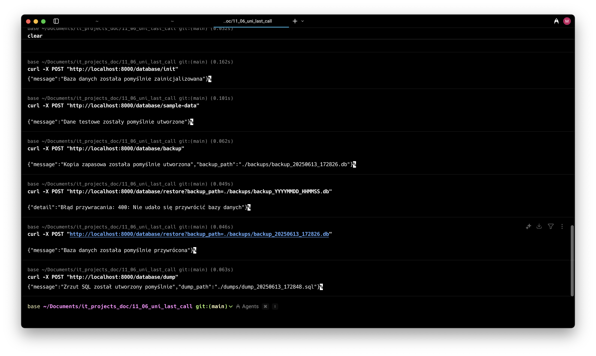
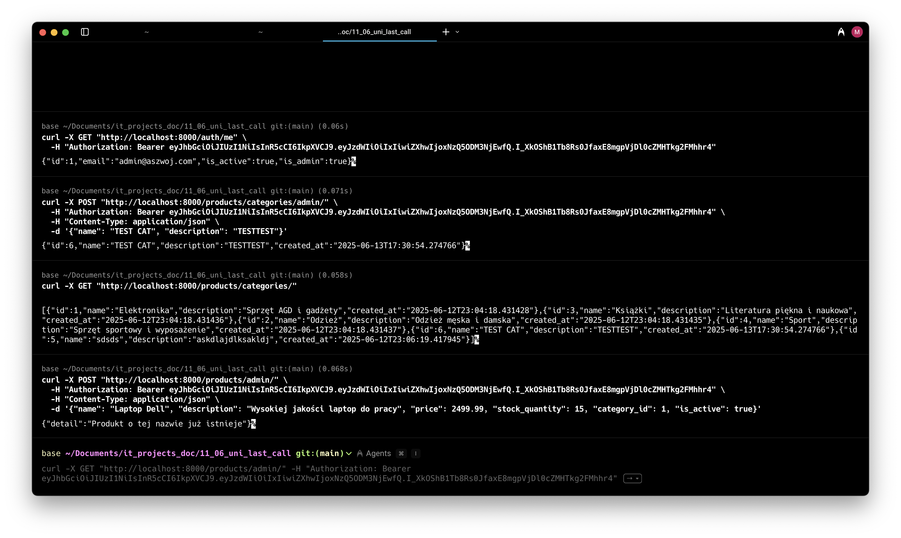
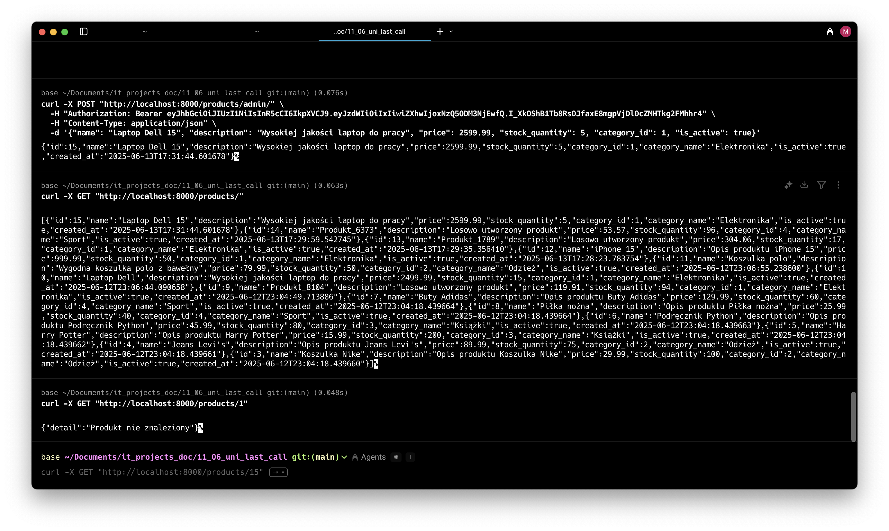
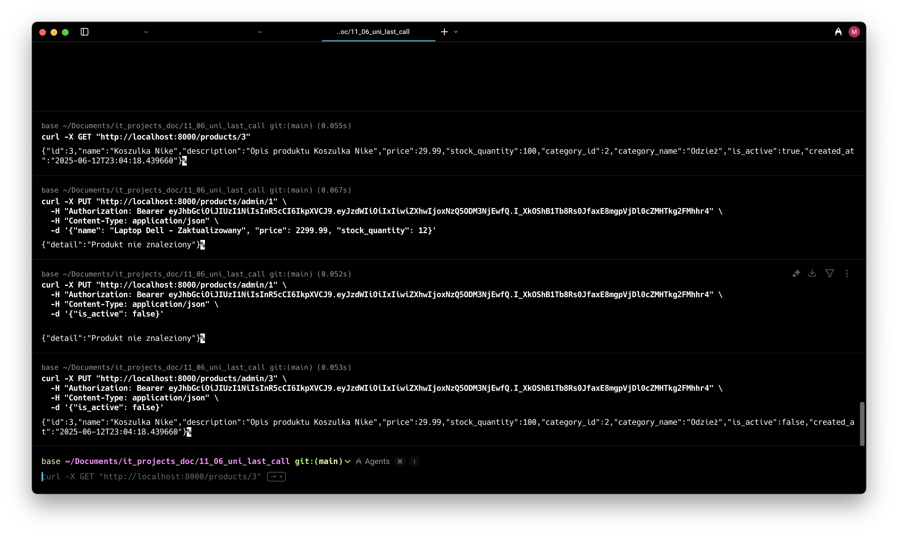
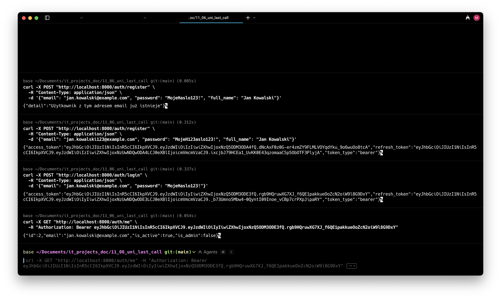
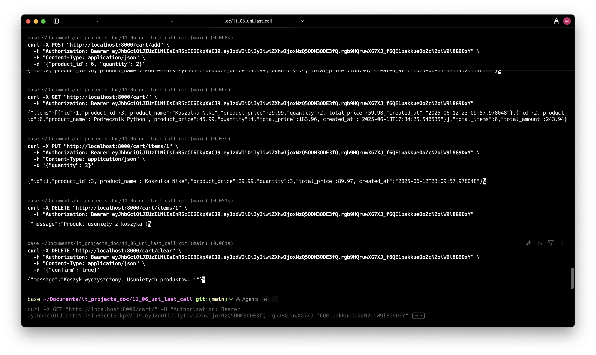
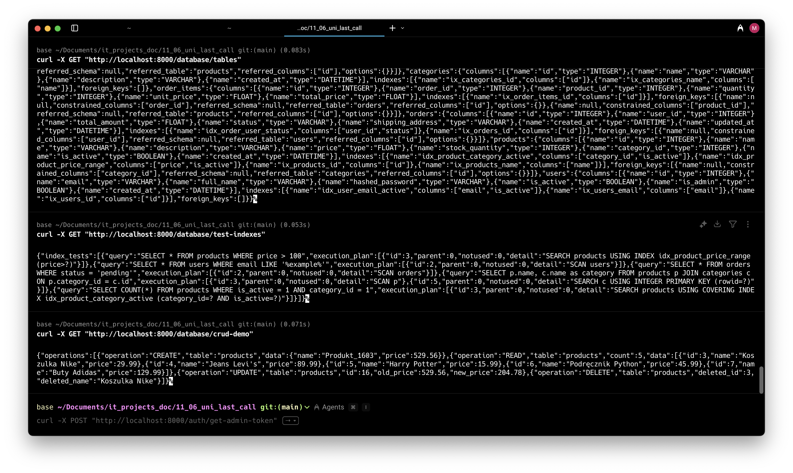

# System E-commerce - Projekt na zaliczenie

## Student
Miraslau Chyhir

## Przedmioty
- Bezpieczeństwo baz danych
- Bezpieczeństwo aplikacji webowych

## Przykłady działania programu
|  |  |  |  |
|----------------------------------|----------------------------------|----------------------------------|----------------------------------|
|  |  |  |  |

## Stos technologiczny
- **Backend**: FastAPI (Python 3.11+)
- **Baza danych**: SQLite
- **Autentykacja**: JWT (JSON Web Tokens)
- **HTTPS**: Certyfikat SSL/TLS
- **Konteneryzacja**: Docker i Docker Compose
- **Backup**: Automatyczne kopie zapasowe bazy danych

## Wymagania systemowe
- Docker i Docker Compose
- Python 3.11+

## Instalacja i uruchomienie

### 1. Sklonuj repozytorium
```bash
git clone https://github.com/miraslauli/BBD-BAW.git
cd BBD-BAW
```

### 2. Uruchomienie z użyciem Docker Compose
```bash
docker-compose up -d
```

### 3. Weryfikacja uruchomienia
```bash
docker-compose ps
docker-compose logs -f api
```

## Testowanie API
### 1. Operacje na bazie danych (wymagane przed pierwszym użyciem)
```bash
# Inicjalizacja bazy danych (OBOWIĄZKOWE jako pierwsze)
curl -X POST "http://localhost:8000/database/init"

# Tworzenie danych testowych
curl -X POST "http://localhost:8000/database/sample-data"

# Wykonanie kopii zapasowej bazy danych
curl -X POST "http://localhost:8000/database/backup"

# Przywrócenie bazy danych z kopii zapasowej
curl -X POST "http://localhost:8000/database/restore?backup_path=./backups/backup_YYYYMMDD_HHMMSS.db"

# Wykonanie zrzutu SQL
curl -X POST "http://localhost:8000/database/dump"

# Testowanie indeksów
curl -X GET "http://localhost:8000/database/test-indexes"

# Demonstracja operacji CRUD
curl -X GET "http://localhost:8000/database/crud-demo"
```

### 2. Pozyskanie tokena administratora (wymagane do zarządzania systemem)
```bash
# Pobieranie tokena administratora
curl -X POST "http://localhost:8000/auth/get-admin-token"

# Dane administratora:
# 📧 Email: admin@aszwoj.com
# 🔑 Hasło: admin123

# ALTERNATYWNIE: Normalne logowanie jako admin
curl -X POST "http://localhost:8000/auth/login" \
  -H "Content-Type: application/json" \
  -d '{"email": "admin@aszwoj.com", "password": "admin123"}'

# Sprawdzenie profilu administratora
curl -X GET "http://localhost:8000/auth/me" \
  -H "Authorization: Bearer [TOKEN_ADMINA]"
```

### 3. Zarządzanie kategoriami (wymaga tokenu administratora)
```bash
# Dodawanie nowej kategorii (WYKONAJ PRZED dodawaniem produktów)
curl -X POST "http://localhost:8000/products/categories/admin/" \
  -H "Authorization: Bearer [TOKEN_ADMINA]" \
  -H "Content-Type: application/json" \
  -d '{"name": "Elektronika", "description": "Produkty elektroniczne i gadżety"}'

# Dodanie kolejnych kategorii (opcjonalne)
curl -X POST "http://localhost:8000/products/categories/admin/" \
  -H "Authorization: Bearer [TOKEN_ADMINA]" \
  -H "Content-Type: application/json" \
  -d '{"name": "Odzież", "description": "Odzież męska i damska"}'

curl -X POST "http://localhost:8000/products/categories/admin/" \
  -H "Authorization: Bearer [TOKEN_ADMINA]" \
  -H "Content-Type: application/json" \
  -d '{"name": "Książki", "description": "Literatura piękna i naukowa"}'

# Pobieranie listy kategorii
curl -X GET "http://localhost:8000/products/categories/"
```

### 4. Zarządzanie produktami (wymaga tokenu administratora)
```bash
# Dodawanie nowego produktu (wymaga istniejącej kategorii)
curl -X POST "http://localhost:8000/products/admin/" \
  -H "Authorization: Bearer [TOKEN_ADMINA]" \
  -H "Content-Type: application/json" \
  -d '{"name": "Laptop Dell", "description": "Wysokiej jakości laptop do pracy", "price": 2499.99, "stock_quantity": 15, "category_id": 1, "is_active": true}'

# Dodanie kolejnych produktów (przykłady)
curl -X POST "http://localhost:8000/products/admin/" \
  -H "Authorization: Bearer [TOKEN_ADMINA]" \
  -H "Content-Type: application/json" \
  -d '{"name": "Koszulka polo", "description": "Wygodna koszulka polo z bawełny", "price": 79.99, "stock_quantity": 50, "category_id": 2, "is_active": true}'

curl -X POST "http://localhost:8000/products/admin/" \
  -H "Authorization: Bearer [TOKEN_ADMINA]" \
  -H "Content-Type: application/json" \
  -d '{"name": "Python dla początkujących", "description": "Podręcznik programowania w języku Python", "price": 45.99, "stock_quantity": 100, "category_id": 3, "is_active": true}'

# Pobieranie listy produktów (publiczne - nie wymaga tokena)
curl -X GET "http://localhost:8000/products/"

# Pobieranie szczegółów produktu
curl -X GET "http://localhost:8000/products/1"

# Aktualizacja produktu (tylko admin)
curl -X PUT "http://localhost:8000/products/admin/1" \
  -H "Authorization: Bearer [TOKEN_ADMINA]" \
  -H "Content-Type: application/json" \
  -d '{"name": "Laptop Dell - Zaktualizowany", "price": 2299.99, "stock_quantity": 12}'

# Dezaktywacja produktu (zamiast usuwania)
curl -X PUT "http://localhost:8000/products/admin/1" \
  -H "Authorization: Bearer [TOKEN_ADMINA]" \
  -H "Content-Type: application/json" \
  -d '{"is_active": false}'
```

### 5. Rejestracja i logowanie zwykłego użytkownika
```bash
# Rejestracja użytkownika
curl -X POST "http://localhost:8000/auth/register" \
  -H "Content-Type: application/json" \
  -d '{"email": "jan.kowalski@example.com", "password": "MojeHaslo123!", "full_name": "Jan Kowalski"}'

# Rejestracja kolejnego użytkownika (przykład)
curl -X POST "http://localhost:8000/auth/register" \
  -H "Content-Type: application/json" \
  -d '{"email": "anna.nowak@example.com", "password": "AnnaHaslo456!", "full_name": "Anna Nowak"}'

# Logowanie użytkownika
curl -X POST "http://localhost:8000/auth/login" \
  -H "Content-Type: application/json" \
  -d '{"email": "jan.kowalski@example.com", "password": "MojeHaslo123!"}'

# Sprawdzenie profilu użytkownika
curl -X GET "http://localhost:8000/auth/me" \
  -H "Authorization: Bearer [TOKEN_UŻYTKOWNIKA]"
```

### 6. Zarządzanie koszykiem (wymaga tokenu użytkownika)
```bash
# Dodawanie produktu do koszyka
curl -X POST "http://localhost:8000/cart/add" \
  -H "Authorization: Bearer [TOKEN_UŻYTKOWNIKA]" \
  -H "Content-Type: application/json" \
  -d '{"product_id": 1, "quantity": 2}'

# Pobieranie zawartości koszyka
curl -X GET "http://localhost:8000/cart/" \
  -H "Authorization: Bearer [TOKEN_UŻYTKOWNIKA]"

# Aktualizacja ilości produktu w koszyku
curl -X PUT "http://localhost:8000/cart/items/1" \
  -H "Authorization: Bearer [TOKEN_UŻYTKOWNIKA]" \
  -H "Content-Type: application/json" \
  -d '{"quantity": 3}'

# Usuwanie produktu z koszyka
curl -X DELETE "http://localhost:8000/cart/items/1" \
  -H "Authorization: Bearer [TOKEN_UŻYTKOWNIKA]"

# Czyszczenie koszyka
curl -X DELETE "http://localhost:8000/cart/clear" \
  -H "Authorization: Bearer [TOKEN_UŻYTKOWNIKA]" \
  -H "Content-Type: application/json" \
  -d '{"confirm": true}'
```


## Elementy bezpieczeństwa

### 1. Bezpieczeństwo bazy danych
- Automatyczne kopie zapasowe co 24 godziny
- Indeksy na kluczowych kolumnach dla optymalizacji zapytań
- Wykonywanie zrzutów SQL przed każdą migracją
- Bezpieczne zapytania CRUD z walidacją danych
- Ochrona przed SQL Injection poprzez ORM (SQLAlchemy)

### 2. Bezpieczeństwo aplikacji
- Autentykacja JWT z tokenami dostępu i odświeżania
- Walidacja wszystkich danych wejściowych (Pydantic)
- Autoryzacja oparta na rolach (admin/user)
- Bezpieczne przechowywanie haseł (bcrypt hashing)
- HTTPS/TLS obsługa przez nginx
- Rate limiting dla API endpoints

### 3. Bezpieczeństwo kontenerów
- Izolacja aplikacji w kontenerach Docker
- Kontrola portów i sieci kontenerów

## Logi i monitoring
```bash
# Podgląd logów na żywo
docker-compose logs -f api

# Ostatnie 50 linii logów
docker-compose logs --tail=50 api
```

## Dokumentacja API
- **Swagger UI**: `http://localhost:8000/docs`
- **ReDoc**: `http://localhost:8000/redoc`
- **OpenAPI Schema**: `http://localhost:8000/openapi.json`
